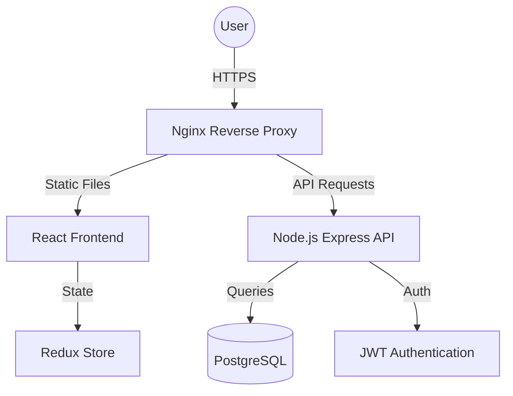

# MessWalha Architecture

## Overview
MessWalha is built using a modern full-stack architecture focused on scalability, maintainability, and user experience.

## Technology Stack
- **Frontend**: React 19, Vite, Tailwind CSS v4, Redux Toolkit, Framer Motion.
- **Backend**: Node.js, Express.js (ESM), TypeScript.
- **Database**: PostgreSQL with Prisma ORM.
- **Infrastructure**: Docker, Nginx, GitHub Actions.

## High-Level Diagram

## System Components
### 1. Frontend
- Managed via Redux for global authentication and app state.
- Component-based architecture with reusable UI elements.
- Responsive design for mobile and desktop.

### 2. Backend
- RESTful API with structured routing and controller-based logic.
- Middleware for authentication, logging (Morgan), and error handling.
- Prisma for type-safe database interactions.

### 3. Data Model
- **User**: Authentication and roles (Student, Owner, Admin).
- **Mess**: Business details, ratings, and locations.
- **Subscription**: Linking students to mess plans.
- **Menu**: Flexible daily food listings.
- **Review**: Student feedback loop.
